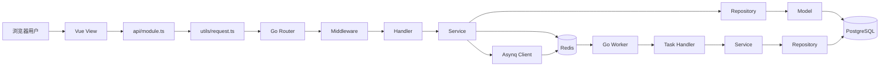
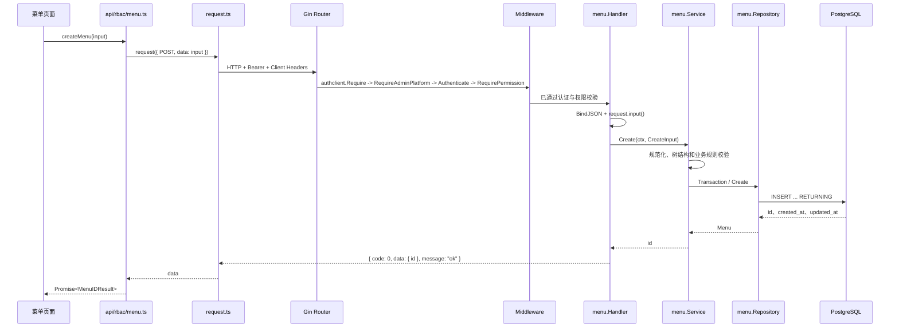
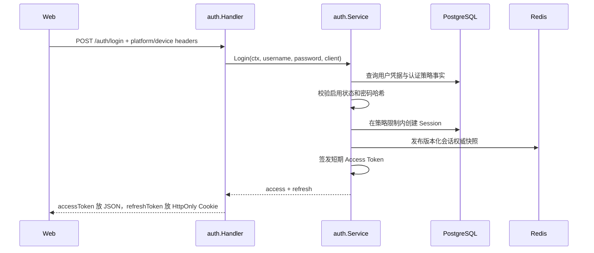
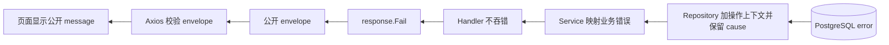

# Admin 当前架构、数据流与 CRUD 手写指南

> 用途：个人学习笔记。本文描述 2026-08-26 当前仓库的实际代码，并提供一个未接入运行时的教学 CRUD 模块。
> 本文不是项目规范或已批准的功能 spec，可以随时删除。

## 1. 先记住一张图



最重要的两条主线是：

```text
前端：view -> api/<module>.ts -> utils/request.ts -> Go API
后端：router -> middleware -> handler -> service -> repository -> model -> PostgreSQL
```

一句话理解每层：

| 层 | 负责什么 | 不应该做什么 |
| --- | --- | --- |
| View | 展示、收集用户输入、触发 API | 猜后端字段、直接写 Axios |
| API TS | 定义前端 DTO，调用 request | 操作页面状态 |
| request.ts | HTTP、请求头、Token、刷新、envelope | 编排具体业务 |
| Router | URL、中间件、Handler 绑定 | 写业务和 SQL |
| Middleware | 请求级认证、权限、日志、语言等 | 实现业务用例 |
| Handler | 绑定请求、边界校验、调用 Service、响应 | 访问数据库和 Redis |
| Service | 业务规则、事务意图、依赖调用顺序 | 依赖 Gin、直接写 GORM 查询 |
| Repository | PostgreSQL 查询、写入、锁、事务 | 处理 HTTP、调用 Queue |
| Model | 表与 Go 字段的映射 | 编排业务 |

## 2. 系统由什么组成

当前项目不是一个进程，而是以下组件协作：

| 组件 | 当前技术 | 主要职责 |
| --- | --- | --- |
| Admin Web | Vue 3、TypeScript、Pinia、Vue Router、Element Plus | 页面、状态、动态路由、调用 API |
| Go API | Gin、GORM | HTTP 入口、业务处理、同步读写 |
| PostgreSQL | PostgreSQL | 用户、角色、菜单、会话、任务、操作日志等权威事实 |
| Redis | go-redis、Asynq | 会话/权限快照缓存、失效协调、异步队列存储 |
| Go Worker | Asynq Server | 消费任务，再经 Service 和 Repository 落 PostgreSQL |

程序入口：

- API：`server/cmd/api/main.go`
- Worker：`server/cmd/worker/main.go`
- Web：`web/src/main.ts`

`server/cmd/api/main.go` 也是当前项目的依赖装配点。以菜单模块为例：

```go
menuRepository := menu.NewRepository(postgres.GORM)
menuService := menu.NewService(menuRepository, accessInvalidator)
menuHandler := menu.NewHandler(menuService)
```

依赖方向是 `Handler -> Service -> Repository`。创建顺序反过来，是因为上层需要拿到下层实例。
项目没有 DI 容器、通用 Factory 或 BaseService；依赖在 `main.go` 显式创建，阅读时一眼能找到。

## 3. 一次 HTTP 请求如何走完整条链

以 `POST /api/admin/v1/menus` 为例：



### 3.1 全局中间件顺序

`server/cmd/api/main.go` 当前按以下顺序注册：

```text
RequestID
-> CORS
-> AccessLog
-> OperationLog
-> Recovery
-> Language
```

`main.go` 明确创建两个 Router Group：共享身份和权限快照使用 `/api/v1`，Admin 管理资源使用
`/api/admin/v1`。两个 Group 都先执行 `authclient.Require()`，读取并验证认证平台、设备等客户端信息；
Admin Group 随后执行 `authclient.RequireAdminPlatform()`，只允许 `X-Auth-Platform: admin` 的请求继续。

共享受保护路由的顺序是：

```text
全局 Middleware -> authclient.Require -> Authenticate -> route middleware -> Handler
```

共享 `POST /api/v1/auth/logout` 还要求精确 Origin，因此它的顺序是：

```text
全局 Middleware -> authclient.Require -> RequireOrigin -> Authenticate -> Handler
```

`RequireOrigin` 必须先于 `Authenticate`，使不匹配的浏览器 Origin 在解析 Bearer Token 前被拒绝。

Admin 受保护路由的顺序是：

```text
全局 Middleware -> authclient.Require -> RequireAdminPlatform -> Authenticate -> RequirePermission("rbac:menu:create") -> Handler
```

顺序很重要：权限中间件需要认证中间件先把 `auth.Identity` 放进 Gin Context。

### 3.2 Handler 为什么只做边界工作

当前菜单创建 Handler 的结构很典型：

```go
func (h *Handler) Create(context *gin.Context) {
    var request createRequest
    if err := validate.BindJSON(context, &request); err != nil {
        response.Fail(context, err)
        return
    }
    input, err := request.input()
    if err != nil {
        response.Fail(context, err)
        return
    }
    id, err := h.service.Create(context.Request.Context(), input)
    if err != nil {
        response.Fail(context, err)
        return
    }
    response.OK(context, http.StatusCreated, menuIDResponse{ID: id})
}
```

它只做四件事：

1. 把 JSON 绑定到 HTTP Request DTO。
2. 把 Request DTO 转成 Service Input。
3. 把 `context.Request.Context()` 传给 Service。
4. 把结果写成统一 envelope。

菜单是否合法、父节点能不能接这种子节点、路径是否冲突，都不是 Handler 的职责。

## 4. 请求 DTO、业务 Input、Model、响应 DTO 不是同一个东西

这四类结构即使字段相似，也解决不同问题：

```text
JSON -> request DTO -> service input -> model/database
                              |
database/model -> service result -> response DTO -> JSON
```

- Request DTO 面向不可信 HTTP 输入，字段可使用指针区分“没传”和“传了零值”。
- Service Input 面向已经完成第一层解析的业务输入，不应该带 JSON tag。
- Model 精确映射 PostgreSQL，不直接当 HTTP 协议使用。
- Response DTO 决定公开字段、命名和时间格式，不把内部字段意外暴露出去。

当前菜单模块对应文件：

```text
request.go    HTTP Request DTO
service.go    CreateInput / UpdateInput / ManagedMenu
model.go      Menu / RoleMenu 数据表映射
response.go   HTTP Response DTO
```

## 5. 从零手写一个简单 Article CRUD

下面是教学代码，不会实际创建到 `server/internal/module/article`。它刻意移除了菜单、用户模块里的缓存失效、复杂锁和权限树，只保留本项目的正确分层。

### 5.1 先决定接口

```text
GET    /api/admin/v1/articles       列表
GET    /api/admin/v1/articles/:id   详情
POST   /api/admin/v1/articles       创建
PUT    /api/admin/v1/articles/:id   更新
DELETE /api/admin/v1/articles/:id   软删除
```

### 5.2 Model：只映射 PostgreSQL

`server/internal/module/article/model.go`：

```go
package article

import (
    "time"

    "gorm.io/gorm"
)

type Article struct {
    ID        int64          `gorm:"column:id;primaryKey;autoIncrement"`
    Title     string         `gorm:"column:title;type:varchar(200);not null"`
    Content   string         `gorm:"column:content;type:text;not null"`
    CreatedAt time.Time      `gorm:"column:created_at;type:timestamptz;not null;default:CURRENT_TIMESTAMP"`
    UpdatedAt time.Time      `gorm:"column:updated_at;type:timestamptz;not null;default:CURRENT_TIMESTAMP"`
    DeletedAt gorm.DeletedAt `gorm:"column:deleted_at;type:timestamptz"`
}

func (Article) TableName() string {
    return "content_article"
}
```

记忆点：

- 每个项目维护表显式写 `CreatedAt` 和 `UpdatedAt`。
- PostgreSQL 时间使用 `TIMESTAMPTZ`。
- 有删除行为就只用 `gorm.DeletedAt`，不要再加 `isDeleted`。
- 不嵌入 `gorm.Model`，也不创建 BaseModel。

### 5.3 Repository：只写数据库操作

`server/internal/module/article/repository.go`：

```go
package article

import (
    "context"
    "fmt"
    "time"

    "gorm.io/gorm"
)

type Repository struct {
    db *gorm.DB
}

func NewRepository(db *gorm.DB) *Repository {
    return &Repository{db: db}
}

func (r *Repository) List(ctx context.Context) ([]Article, error) {
    rows := make([]Article, 0)
    err := r.db.WithContext(ctx).
        Order("created_at DESC, id DESC").
        Find(&rows).Error
    if err != nil {
        return nil, fmt.Errorf("list articles: %w", err)
    }
    return rows, nil
}

func (r *Repository) Find(ctx context.Context, id int64) (Article, error) {
    var row Article
    if err := r.db.WithContext(ctx).First(&row, "id = ?", id).Error; err != nil {
        return Article{}, fmt.Errorf("find article: %w", err)
    }
    return row, nil
}

func (r *Repository) Create(ctx context.Context, row *Article) error {
    if err := r.db.WithContext(ctx).Create(row).Error; err != nil {
        return fmt.Errorf("create article: %w", err)
    }
    return nil
}

func (r *Repository) Update(
    ctx context.Context,
    id int64,
    title string,
    content string,
    updatedAt time.Time,
) error {
    result := r.db.WithContext(ctx).
        Model(&Article{}).
        Where("id = ?", id).
        Updates(map[string]any{
            "title": title, "content": content, "updated_at": updatedAt,
        })
    if result.Error != nil {
        return fmt.Errorf("update article: %w", result.Error)
    }
    if result.RowsAffected != 1 {
        return fmt.Errorf("update article: %w", gorm.ErrRecordNotFound)
    }
    return nil
}

func (r *Repository) Delete(ctx context.Context, id int64, deletedAt time.Time) error {
    result := r.db.WithContext(ctx).
        Model(&Article{}).
        Where("id = ?", id).
        Updates(map[string]any{
            "updated_at": deletedAt.UTC(),
            "deleted_at": deletedAt.UTC(),
        })
    if result.Error != nil {
        return fmt.Errorf("delete article: %w", result.Error)
    }
    if result.RowsAffected != 1 {
        return fmt.Errorf("delete article: %w", gorm.ErrRecordNotFound)
    }
    return nil
}
```

Repository 的固定写法：

1. 每次查询都用 `db.WithContext(ctx)`。
2. 给底层错误加操作语义，再 `%w` 保留 cause。
3. Update/Delete 检查 `RowsAffected`，否则“不存在”可能被当成成功。
4. 不在这里判断标题能否为空；那是 Service 的业务规则。
5. 不返回 HTTP 状态码；Repository 不知道 HTTP 存在。

### 5.4 Service：业务规则放这里

`server/internal/module/article/service.go`：

```go
package article

import (
    "context"
    "errors"
    "fmt"
    "strings"
    "time"
    "unicode/utf8"

    "admin/server/internal/shared/apperror"
    "gorm.io/gorm"
)

type WriteInput struct {
    Title   string
    Content string
}

type Item struct {
    ID        int64
    Title     string
    Content   string
    CreatedAt time.Time
    UpdatedAt time.Time
}

type Service struct {
    repository *Repository
}

func NewService(repository *Repository) *Service {
    return &Service{repository: repository}
}

func (s *Service) List(ctx context.Context) ([]Item, error) {
    rows, err := s.repository.List(ctx)
    if err != nil {
        return nil, apperror.DependencyUnavailable(err)
    }
    items := make([]Item, 0, len(rows))
    for _, row := range rows {
        items = append(items, toItem(row))
    }
    return items, nil
}

func (s *Service) Get(ctx context.Context, id int64) (Item, error) {
    if id < 1 {
        return Item{}, apperror.InvalidRequest(fmt.Errorf("article id is invalid"))
    }
    row, err := s.repository.Find(ctx, id)
    if err != nil {
        return Item{}, mapRepositoryError(err)
    }
    return toItem(row), nil
}

func (s *Service) Create(ctx context.Context, input WriteInput) (Item, error) {
    normalized, err := normalizeInput(input)
    if err != nil {
        return Item{}, apperror.InvalidRequest(err)
    }
    row := Article{Title: normalized.Title, Content: normalized.Content}
    if err := s.repository.Create(ctx, &row); err != nil {
        return Item{}, apperror.DependencyUnavailable(err)
    }
    return toItem(row), nil
}

func (s *Service) Update(ctx context.Context, id int64, input WriteInput) error {
    if id < 1 {
        return apperror.InvalidRequest(fmt.Errorf("article id is invalid"))
    }
    normalized, err := normalizeInput(input)
    if err != nil {
        return apperror.InvalidRequest(err)
    }
    updatedAt := time.Now().UTC().Truncate(time.Microsecond)
    if err := s.repository.Update(ctx, id, normalized.Title, normalized.Content, updatedAt); err != nil {
        return mapRepositoryError(err)
    }
    return nil
}

func (s *Service) Delete(ctx context.Context, id int64) error {
    if id < 1 {
        return apperror.InvalidRequest(fmt.Errorf("article id is invalid"))
    }
    deletedAt := time.Now().UTC().Truncate(time.Microsecond)
    if err := s.repository.Delete(ctx, id, deletedAt); err != nil {
        return mapRepositoryError(err)
    }
    return nil
}

func normalizeInput(input WriteInput) (WriteInput, error) {
    input.Title = strings.TrimSpace(input.Title)
    input.Content = strings.TrimSpace(input.Content)
    if input.Title == "" || utf8.RuneCountInString(input.Title) > 200 {
        return WriteInput{}, fmt.Errorf("title must contain 1 to 200 characters")
    }
    if input.Content == "" {
        return WriteInput{}, fmt.Errorf("content is required")
    }
    return input, nil
}

func mapRepositoryError(err error) error {
    if errors.Is(err, gorm.ErrRecordNotFound) {
        return apperror.NotFound(err)
    }
    return apperror.DependencyUnavailable(err)
}

func toItem(row Article) Item {
    return Item{
        ID: row.ID, Title: row.Title, Content: row.Content,
        CreatedAt: row.CreatedAt, UpdatedAt: row.UpdatedAt,
    }
}
```

Service 才是用例本身：

- `Create` 表示“创建文章”这个业务动作。
- 它先规范化输入，再决定 Repository 调用顺序。
- 它把数据库错误映射为公开错误语义。
- 如果一次业务修改涉及多张表，事务意图也放在 Service，由 Repository 暴露事务方法。

### 5.5 Request 和 Response DTO

`server/internal/module/article/request.go`：

```go
package article

import (
    "fmt"
    "strconv"

    "admin/server/internal/shared/apperror"
)

type writeRequest struct {
    Title   *string `json:"title"`
    Content *string `json:"content"`
}

func (r writeRequest) input() (WriteInput, error) {
    if r.Title == nil || r.Content == nil {
        return WriteInput{}, apperror.InvalidRequest(
            fmt.Errorf("title and content are required"),
        )
    }
    return WriteInput{Title: *r.Title, Content: *r.Content}, nil
}

func parseArticleID(value string) (int64, error) {
    id, err := strconv.ParseInt(value, 10, 64)
    if err != nil || id < 1 {
        return 0, apperror.InvalidRequest(fmt.Errorf("article id is invalid"))
    }
    return id, nil
}
```

使用 `*string` 是为了区分：

```json
{}
```

和：

```json
{"title":"","content":""}
```

前者是字段缺失，Handler 边界就能拒绝；后者字段存在，但内容是否合法由 Service 判断。

`server/internal/module/article/response.go`：

```go
package article

import "time"

type itemResponse struct {
    ID        int64  `json:"id"`
    Title     string `json:"title"`
    Content   string `json:"content"`
    CreatedAt string `json:"createdAt"`
    UpdatedAt string `json:"updatedAt"`
}

type idResponse struct {
    ID int64 `json:"id"`
}

func newItemResponse(item Item) itemResponse {
    return itemResponse{
        ID: item.ID, Title: item.Title, Content: item.Content,
        CreatedAt: item.CreatedAt.UTC().Format(time.RFC3339Nano),
        UpdatedAt: item.UpdatedAt.UTC().Format(time.RFC3339Nano),
    }
}

func newItemResponses(items []Item) []itemResponse {
    result := make([]itemResponse, 0, len(items))
    for _, item := range items {
        result = append(result, newItemResponse(item))
    }
    return result
}
```

### 5.6 Handler：把 HTTP 翻译成 Service 调用

`server/internal/module/article/handler.go`：

```go
package article

import (
    "context"
    "net/http"

    "admin/server/internal/shared/response"
    "admin/server/internal/shared/validate"
    "github.com/gin-gonic/gin"
)

type articleService interface {
    List(context.Context) ([]Item, error)
    Get(context.Context, int64) (Item, error)
    Create(context.Context, WriteInput) (Item, error)
    Update(context.Context, int64, WriteInput) error
    Delete(context.Context, int64) error
}

type Handler struct {
    service articleService
}

func NewHandler(service articleService) *Handler {
    return &Handler{service: service}
}

func (h *Handler) List(c *gin.Context) {
    items, err := h.service.List(c.Request.Context())
    if err != nil {
        response.Fail(c, err)
        return
    }
    response.OK(c, http.StatusOK, newItemResponses(items))
}

func (h *Handler) Get(c *gin.Context) {
    id, err := parseArticleID(c.Param("id"))
    if err != nil {
        response.Fail(c, err)
        return
    }
    item, err := h.service.Get(c.Request.Context(), id)
    if err != nil {
        response.Fail(c, err)
        return
    }
    response.OK(c, http.StatusOK, newItemResponse(item))
}

func (h *Handler) Create(c *gin.Context) {
    var request writeRequest
    if err := validate.BindJSON(c, &request); err != nil {
        response.Fail(c, err)
        return
    }
    input, err := request.input()
    if err != nil {
        response.Fail(c, err)
        return
    }
    item, err := h.service.Create(c.Request.Context(), input)
    if err != nil {
        response.Fail(c, err)
        return
    }
    response.OK(c, http.StatusCreated, newItemResponse(item))
}

func (h *Handler) Update(c *gin.Context) {
    id, err := parseArticleID(c.Param("id"))
    if err != nil {
        response.Fail(c, err)
        return
    }
    var request writeRequest
    if err := validate.BindJSON(c, &request); err != nil {
        response.Fail(c, err)
        return
    }
    input, err := request.input()
    if err != nil {
        response.Fail(c, err)
        return
    }
    if err := h.service.Update(c.Request.Context(), id, input); err != nil {
        response.Fail(c, err)
        return
    }
    response.OK(c, http.StatusOK, idResponse{ID: id})
}

func (h *Handler) Delete(c *gin.Context) {
    id, err := parseArticleID(c.Param("id"))
    if err != nil {
        response.Fail(c, err)
        return
    }
    if err := validate.RequireEmptyBody(c); err != nil {
        response.Fail(c, err)
        return
    }
    if err := h.service.Delete(c.Request.Context(), id); err != nil {
        response.Fail(c, err)
        return
    }
    response.OK(c, http.StatusOK, idResponse{ID: id})
}
```

Handler 里的 `articleService` 小接口主要服务于 Handler 单元测试。Service 本身直接依赖当前唯一的 `*Repository`，不为假想替换创建通用抽象。

### 5.7 Router：声明 URL 和边界中间件

`server/internal/module/article/route.go`：

下面的 `content:article:read` 仅是接口动作权限示例，不是 `menuType=page` 的页面入口；任何
页面菜单节点仍必须使用资源级 `:list`（详情页也不能命名为 `:view`/`:read`）。

```go
package article

import "github.com/gin-gonic/gin"

func RegisterRoutes(
    routes *gin.RouterGroup,
    handler *Handler,
    authenticate gin.HandlerFunc,
    requirePermission func(string) gin.HandlerFunc,
) {
    routes.GET("/articles", authenticate, requirePermission("content:article:list"), handler.List)
    routes.GET("/articles/:id", authenticate, requirePermission("content:article:read"), handler.Get)
    routes.POST("/articles", authenticate, requirePermission("content:article:create"), handler.Create)
    routes.PUT("/articles/:id", authenticate, requirePermission("content:article:update"), handler.Update)
    routes.DELETE("/articles/:id", authenticate, requirePermission("content:article:delete"), handler.Delete)
}
```

最后在 `server/cmd/api/main.go` 装配：

```go
articleRepository := article.NewRepository(postgres.GORM)
articleService := article.NewService(articleRepository)
articleHandler := article.NewHandler(articleService)

article.RegisterRoutes(adminRoutes, articleHandler, authenticate, requirePermission)
```

如果这个模块真实加入项目，还必须补 Model migration、数据库约束、权限菜单、测试和前端接入。这里只演示数据流，不是在偷偷引入 Article 功能。

## 6. CRUD 五个动作分别在想什么

### Create

```text
绑定 JSON -> 检查必填字段 -> 业务规范化 -> 构造 Model -> INSERT -> 返回公开 DTO
```

创建时不要信任客户端传来的 ID、创建时间、更新时间和删除时间。

### Read One

```text
解析 path ID -> Repository Find -> not found 映射 -> 返回 DTO
```

GORM 默认会给包含 `gorm.DeletedAt` 的查询加 `deleted_at IS NULL`，所以软删除记录不会被普通 `Find` 找到。

### List

```text
解析查询参数 -> Service 校验筛选/分页 -> Count -> List -> 返回 list/total/page/pageSize
```

教学例子省略了分页。真实管理列表应参考 `user.List` 或 `operationlog.List`，统一返回分页结果，不能一次读完整张表。

### Update

```text
解析 ID -> 绑定完整更新 DTO -> 业务校验 -> UPDATE + updated_at -> 检查 RowsAffected
```

如果接口使用 `PUT`，通常要求完整资源字段；如果使用 `PATCH`，必须明确哪些字段可选以及“缺失”和 `null` 的语义。

### Delete

```text
解析 ID -> 要求空 body -> 业务删除约束 -> 软删除 -> 检查 RowsAffected
```

删除不是天然属于 Repository 的一个按钮。比如当前菜单删除还要处理后代菜单、角色授权和权限版本；这些顺序由 Service 编排。

## 7. 教学 CRUD 与真实 menu 模块的差别

真实菜单不是简单表 CRUD，因为它是一棵权限树：

- 根节点必须是目录。
- 目录只能包含目录或页面，页面下面只能挂 action 权限。
- 页面需要 `path` 和 `componentPath`；action 不允许带渲染字段。
- 创建和更新要检查 code、页面路径、父子类型和循环关系。
- 禁用目录时同时禁用后代。
- 删除节点时同时软删除后代和对应角色授权。
- 基础菜单受保护，不能随意变更结构或删除。
- 菜单变化影响所有活跃用户的权限快照，因此要推进 access version 并使缓存失效。

真实文件对应：

```text
server/internal/module/rbac/menu/route.go       路由和权限码
server/internal/module/rbac/menu/request.go     严格请求 DTO
server/internal/module/rbac/menu/handler.go     HTTP 边界
server/internal/module/rbac/menu/service.go     菜单树业务和权限失效编排
server/internal/module/rbac/menu/repository.go  PostgreSQL、锁和事务内查询
server/internal/module/rbac/menu/model.go       rbac_menu / rbac_role_menu
server/internal/module/rbac/menu/response.go    返回 DTO
```

最近协议调整后的关键点：

- `i18nKey` 在数据库和管理 DTO 中可为 `null`，但可渲染的目录/页面进入 access snapshot 时仍必须具备合法 i18n key。
- 页面用 `componentPath` 指向 `web/src/views/<componentPath>/index.vue`。
- 图标只能来自前端 `menu-icons` 白名单。
- 菜单管理 API 的字段校验函数现在收拢在 `web/src/api/rbac/menu.ts`。

不要把 `menu.Service` 的复杂度复制到普通 CRUD。复杂是因为业务规则复杂，不是每个 Service 都应该复杂。

## 8. user 模块告诉我们的进阶知识

用户更新、状态切换、角色分配和删除会影响认证与授权，因此 `user.Service` 比普通 CRUD 多出：

1. **事务**：多张表修改必须一起成功或失败。
2. **行锁/表锁**：避免两个管理员同时修改造成最后一个超级管理员被移除等竞态。
3. **操作者与目标用户**：Service 同时接收 actor ID 和 target ID，用于禁止自我禁用、自删等规则。
4. **认证失效**：禁用或删除用户后，旧会话不能继续被当成有效。
5. **权限失效**：角色变化后，旧权限快照不能继续使用。
6. **版本推进**：PostgreSQL 内的 version 是变化依据，Redis 用版本化 key 缓存结果。

典型事务形状：

```go
err := repository.Transaction(ctx, func(repository *Repository) error {
    target, err := repository.LockUser(ctx, targetUserID)
    if err != nil {
        return err
    }
    if err := checkBusinessRules(target); err != nil {
        return err
    }
    if err := repository.UpdateStatus(ctx, target.ID, value, now); err != nil {
        return err
    }
    return repository.IncrementAccessVersion(ctx, target.ID, now)
})
```

事务回调里仍然只用 Repository 做数据库操作。Service 负责“先锁谁、检查什么、再改什么”。

## 9. 登录、会话和权限数据流

### 9.1 登录



当前设计不是把两个 Token 都放 localStorage：

- Access Token 保存在 Pinia 内存状态，前端请求时加 `Authorization: Bearer ...`。
- Refresh Token 放按认证平台命名的 HttpOnly Cookie，浏览器脚本不能直接读取。
- 页面刷新后 Pinia Access Token 丢失，路由守卫调用 `/auth/refresh` 换取新 Access Token。
- 刷新成功后再调用 `/auth/me` 取得当前用户。

### 9.2 每个受保护请求

```text
authclient.Require
-> Authenticate
-> 解析 JWT
-> 校验 platform
-> 尝试 Redis 会话快照
-> 缓存未命中时从 PostgreSQL 读取权威会话
-> 把 Identity 放进 Gin Context
-> RequirePermission
-> Handler
```

`*gin.Context` 到 Middleware/Handler 为止。向 Service 传的是 `context.Request.Context()`；不要把 Gin Context 传到业务层。

### 9.3 权限快照和动态菜单

前端首次进入受保护页面时：

```text
permission.ts 路由守卫
-> 确保认证
-> GET /api/v1/access
-> access.Service.Current
-> Redis 读取版本化快照，未命中则从 PostgreSQL 重建
-> 返回 roleCodes + menuTree + permissionCodes
-> Pinia access store
-> registerAccessRoutes()
-> import.meta.glob 匹配 componentPath
-> router.addRoute()
```

菜单中的 page 节点生成页面路由，action 节点不生成页面，但它的 code 会进入 `permissionCodes`，供按钮权限和后端权限中间件使用。

当前 `rbac:menu:list` 页面是一个静态绑定特例：前端要求它的 code、path、componentPath 精确匹配静态路由，其他页面可以按 access snapshot 动态注册。

## 10. PostgreSQL 与 Redis 谁说了算

先背结论：

```text
PostgreSQL 是业务事实来源；Redis 是缓存、协调状态和队列存储。
```

Redis 中的会话/权限快照可以加速读取，但不能反过来成为用户、角色、菜单的唯一事实。
当前缓存 key 带用户、平台、策略版本或 access version。业务变化时先推进权威版本，再让旧版本 key 自然失效或删除。

为什么不能只 `DEL cacheKey`：

- 删除和并发重建可能交错，旧请求可能在删除之后重新写回旧数据。
- 版本化 key 让新请求只寻找新版本，旧结果即使晚到也不会被当成当前结果。
- invalidating/ready 状态和 lease 用于协调正在发生的变更。

缓存错误必须可观察。当前认证和权限代码会记录 cache kind/result；只有明确设计允许时才从 PostgreSQL 重建，不能临时切成内存数据或返回假成功。

## 11. Asynq 异步数据流

当前 Worker 只消费操作日志任务。正式业务任务出现后，应根据事实归属单独设计任务 payload 和事务边界，不保留演示性实体或接口。

### 11.1 不可变事件类：operationlog

操作日志在请求结束后已经形成一个不可变事件，所以 payload 可以携带闭合 DTO：

```text
OperationLog Middleware
-> 根据 route rule 捕获并脱敏请求/响应摘要
-> 生成 version=2 的 TaskPayload
-> Asynq 入队
-> Worker 严格校验 payload
-> operationlog.Service.Process
-> Repository 幂等 INSERT PostgreSQL
```

payload 带 `eventId`，数据库按 event ID 防重复。密码、Token、Cookie、secret 等字段会被替换为 `***`，摘要还有大小上限。

注意：操作日志入队失败会记录错误，但不会把已经完成的业务响应改成失败。这是操作日志当前明确采用的旁路语义，不代表其他业务任务也能吞掉队列错误。

## 12. 错误如何从数据库回到浏览器



后端公开错误类型位于 `server/internal/shared/apperror/error.go`：

| Code | HTTP | 语义 |
| --- | --- | --- |
| 10000 | 500 | 内部错误 |
| 10001 | 400 | 请求无效 |
| 10002 | 401 | 未认证 |
| 10003 | 403 | 无权限 |
| 10004 | 404 | 不存在 |
| 10005 | 409 | 冲突 |
| 10006 | 503 | 依赖不可用 |

公开响应固定是：

```json
{
  "code": 0,
  "data": {},
  "message": "ok"
}
```

失败时 `code` 非零，`data` 为 `null`。内部 cause 交给服务端日志，客户端只收到本地化公开 message，不会收到 SQL、堆栈、Token 或 DSN。

`validate.BindJSON` 当前会拒绝：

- 未知 JSON 字段；
- 重复 JSON key；
- 一个 body 中的多个 JSON 文档；
- binding validator 不通过的字段。

这就是为什么不要直接使用宽松的 `ShouldBindJSON` 替换项目 helper。

## 13. 前端数据流与当前实现差异

以菜单页面为例：

```text
views/access/menus/index.vue
-> api/rbac/menu.ts 的 createMenu()
-> utils/request.ts 的 request<T>()
-> Axios 请求拦截器添加 Accept-Language、X-Auth-Platform、X-Device-ID、Bearer
-> Go API
-> Axios 响应拦截器严格检查 envelope
-> data 返回页面
```

`request.ts` 精确要求响应只能包含 `code`、`data`、`message`，字段集合或类型不对就抛 `ProtocolError`。401 时它会协调并发刷新，确保同一时间只发一个 refresh 请求，然后重放原请求。

### 当前需要特别注意的差距

最近调整后，`menu.ts`、`access.ts`、`auth.ts` 等多个业务 API 直接调用 `request<DTO>()`。这提供 TypeScript 编译期类型，但大多数返回值没有在业务 API 层从 `unknown` 做运行时字段校验。

也就是说，下面的泛型不会验证服务器真的返回了 `{ id: number }`：

```ts
return request<MenuIDResult>({ method: 'POST', url: '/api/admin/v1/menus', data: input })
```

它只是告诉 TypeScript “开发者认为结果是 MenuIDResult”。严格 envelope 仍然存在，但业务 `data` 可能在字段错误时晚到页面才暴露。

根据项目硬规则，推荐的新 API 写法应是：

```ts
export async function createArticle(input: CreateArticleInput): Promise<ArticleIDResult> {
  const value: unknown = await request<unknown>({
    method: 'POST',
    url: '/api/admin/v1/articles',
    data: input,
  })
  return parseArticleIDResult(value)
}
```

然后 `parseArticleIDResult` 精确检查对象字段集合和字段类型。本文把这点标为当前实现差距，不把它包装成推荐架构。

## 14. 下次手写 CRUD 的固定顺序

不要从 Handler 随手写起。按下面顺序更稳定：

1. 写清楚资源、URL、动作、权限码和请求/响应 JSON。
2. 设计 PostgreSQL 表、约束、索引、时间字段和删除语义。
3. 写 Model，只表达数据库映射。
4. 写 Repository 方法和 Repository 测试。
5. 先写 Service 失败测试，再写业务规则和事务编排。
6. 写 Request DTO、Response DTO 和 Handler 测试。
7. 写 Handler，只负责 HTTP 边界。
8. 写 Route，按顺序挂认证和权限中间件。
9. 在 `cmd/api/main.go` 显式装配依赖。
10. 写前端 DTO 运行时解析、API 函数、页面调用。
11. 运行定向测试，再按影响范围扩大验证。

可以用这段口诀检查代码放错层没有：

```text
URL 看 Router
请求看 Handler
规则看 Service
SQL 看 Repository
表看 Model
缓存和队列由 Service 决定调用顺序
```

## 15. 手写完成后的检查清单

### 后端

- [ ] Router 只声明 URL、中间件和 Handler。
- [ ] Handler 使用严格 BindJSON，并传递 `context.Request.Context()`。
- [ ] Service 不导入 Gin，不直接写 GORM 查询。
- [ ] Repository 每次 I/O 使用 `WithContext(ctx)`。
- [ ] Model 显式包含 `CreatedAt` 和 `UpdatedAt`。
- [ ] 有删除行为时只使用 `gorm.DeletedAt`。
- [ ] Yes/No 使用 `shared/yesno`，数据库使用 SMALLINT + CHECK。
- [ ] Update/Delete 检查 `RowsAffected`。
- [ ] 多表业务变化有事务、锁和并发规则。
- [ ] 依赖失败显式返回，不用内存、空数组或假成功兜底。
- [ ] 响应只输出 `code`、`data`、`message`。

### 前端

- [ ] 页面只调用 `api/<module>.ts`。
- [ ] API 输入、输出 DTO 明确，没有 `any`。
- [ ] 外部 `data` 从 `unknown` 开始做运行时校验。
- [ ] 页面不猜字段、不兼容 `msg`、不静默补必填默认值。
- [ ] 路由、菜单、按钮权限都使用后端批准的 permission code。

### 测试

- [ ] Handler 测试覆盖畸形 JSON、未知字段、缺字段和响应 envelope。
- [ ] Service 测试覆盖业务成功、冲突、不存在和依赖失败。
- [ ] Repository 测试使用真实 PostgreSQL 语义，不用内存数据库替代。
- [ ] 前端 API 测试覆盖正确 DTO 和协议畸形数据。
- [ ] 行为变化遵循“失败测试 -> 最小实现 -> 通过 -> 重构”。

## 16. 阅读当前项目的推荐路线

按这个顺序读，不容易迷路：

1. `server/cmd/api/main.go`：先看依赖怎样组装、路由怎样注册。
2. `server/internal/module/rbac/menu/route.go`：看 URL 和权限。
3. `server/internal/module/rbac/menu/handler.go`：看 HTTP 边界。
4. `server/internal/module/rbac/menu/request.go`、`response.go`：看协议。
5. `server/internal/module/rbac/menu/service.go`：看业务规则和失效编排。
6. `server/internal/module/rbac/menu/repository.go`：看 SQL、锁和事务。
7. `server/internal/module/rbac/menu/model.go`：看 PostgreSQL 映射。
8. `web/src/utils/request.ts`：看 HTTP envelope、Token 和 refresh。
9. `web/src/permission.ts`：看认证恢复和权限快照加载。
10. `web/src/router/access-routes.ts`：看 componentPath 如何变成 Vue 页面。
11. `server/cmd/worker/main.go` 与 `operationlog/task.go`：看异步消费。

如果能不用看源码、仅凭本章说出以下过程，就掌握了主干：

```text
Vue 点击保存
-> API DTO
-> Axios
-> Router/Middleware
-> Handler 绑定
-> Service 规则
-> Repository SQL
-> PostgreSQL
-> Response DTO/envelope
-> Axios 校验
-> 页面更新
```
